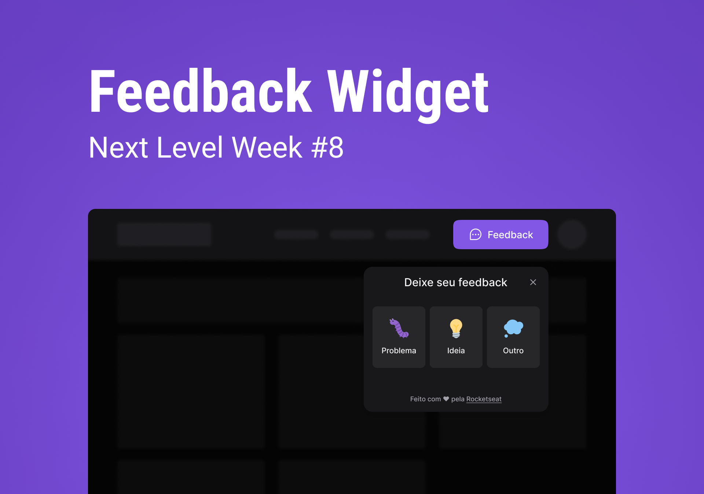

    

<h1 align="center">
	NLW Return Impulse by Rockeseat
</h1>

Trilha Impulse do Evento Next Level Week Return.

  

  

  

## 🚀 Projeto

Um Component Widget para feedback que pode ser utilizado em qualquer site.

## 🔧 Tecnologias

- Vite
- TailWindCSS
- ReactJS
- NodeJS
- React native
- Expo
- ESLint + Prettier + EditorConfig;
- VS Code

## 🚀 **Em constante evolução...**

---

Feito por [Hygor Martins](https://www.linkedin.com/in/hygormartins/)